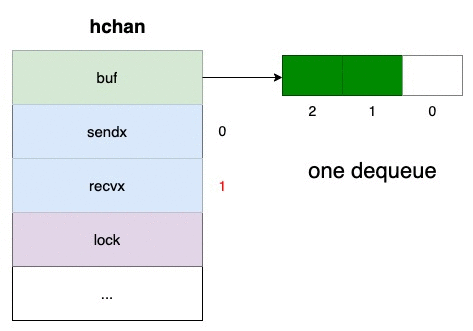

# csp

Communicating Sequential Processes

## channels


A `goroutine` is a lightweight user-space thread.<br/>
A `channel` is for communication between goroutines.<br/>

### Channel Structure

Create a buffered channel:
```go
ch := make(chan int, 3) // 3 items buffer
```

Struct `hchan` represents a channel:
<br/>

```go
type hchan struct {
  buf unsafe.Pointer // pointer to an array (circular queue)
  sendx uint  // index of the sent element in the array (idx < buf size)
  recvx uint  // index of the received element in the array (idx < buf size)
  sendq waitq // linked list of blocked goroutines while trying to read data on the channel
  recvq waitq // linked list of blocked goroutines while trying to send data from the channel
  lock mutex  // lock ensures that the reading and writing of the channel is an atomic operation
}

type waitq struct {
  head *sudog
  tail *sudog
}

type sudog struct {
  g *g
  c *hchan
  next *sudog
  prev *sudog
  elem unsafe.Pointer
}
```

### Sends To The Channel

When channel is not full, we can insert elements w/o block.
```go
ch <- elem1 // buffer = 1
ch <- elem2 // buffer = 2
ch <- elem3 // buffer = 3
```


When channel is full, next send operation blocks respective goroutine.<br/>
All the blocked goroutines are stored inside the `sendq` queue (linked list).<br/>


Send goroutine to get resumed:
<br/>

### Receives From The Channel

When channel is not empty, we can receive elements w/o block.
```go
<- ch // goroutine reads from channel, buffer = 2
<- ch // goroutine reads from channel, buffer = 1
<- ch // goroutine reads from channel, buffer = 0
```



When channel is empty, receive operation blocks current goroutine.<br/>
All the blocked goroutines are stored inside the `recvq` queue (linked list).<br/>


Receive goroutine to get resumed:
<br/>
