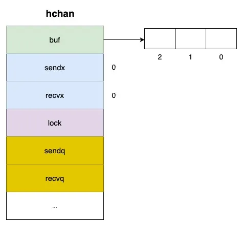
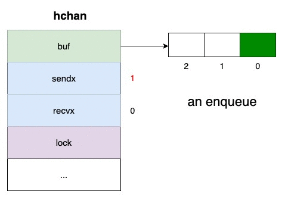
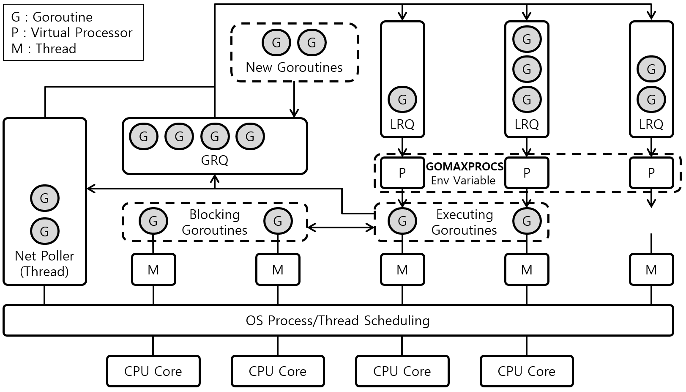
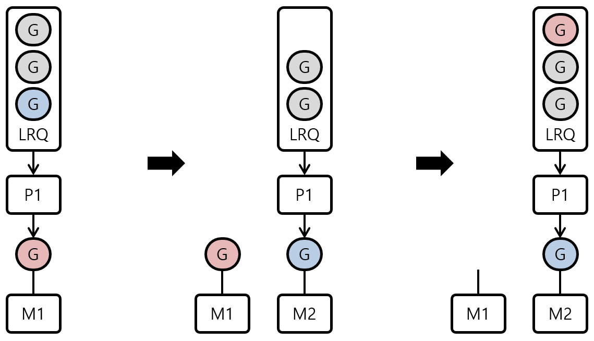

# csp

Communicating Sequential Processes

## channels


A `goroutine` is a lightweight user-space thread.<br/>
A `channel` is for communication between goroutines.<br/>

### Channel Structure

Create a buffered channel:
```go
ch := make(chan int, 3) // 3 items buffer
```

Struct `hchan` represents a channel:
<br/>

```go
type hchan struct {
  buf unsafe.Pointer // pointer to an array (circular queue)
  sendx uint  // index of the sent element in the array (idx < buf size)
  recvx uint  // index of the received element in the array (idx < buf size)
  sendq waitq // linked list of blocked goroutines while trying to read data on the channel
  recvq waitq // linked list of blocked goroutines while trying to send data from the channel
  lock mutex  // lock ensures that the reading and writing of the channel is an atomic operation
}

type waitq struct {
  head *sudog
  tail *sudog
}

type sudog struct {
  g *g
  c *hchan
  next *sudog
  prev *sudog
  elem unsafe.Pointer
}
```

### Sends To The Channel

When channel is not full, we can insert elements w/o block.
```go
ch <- elem1 // buffer = 1
ch <- elem2 // buffer = 2
ch <- elem3 // buffer = 3
```



When channel is full, next send operation blocks respective goroutine.<br/>
All the blocked goroutines are stored inside the `sendq` queue (linked list).<br/>


Send goroutine to get resumed:
<br/>

### Receives From The Channel

When channel is not empty, we can receive elements w/o block.
```go
<- ch // goroutine reads from channel, buffer = 2
<- ch // goroutine reads from channel, buffer = 1
<- ch // goroutine reads from channel, buffer = 0
```


When channel is empty, receive operation blocks current goroutine.<br/>
All the blocked goroutines are stored inside the `recvq` queue (linked list).<br/>


Receive goroutine to get resumed:
<br/>

## scheduler



Many goroutines run on a small number of threads.<br/>
Image above shows the Goroutine Scheduling process.<br/>
Abbreviation: [M] = Thread, [P] = Processor, [G] = Goroutine.<br/>
Processor means a virtual processor (Virtual CPU Core), not the actual number of CPU cores.<br/>
In image, there are 4 CPU cores, and a number of threads are scheduled and operated by the OS scheduler.<br/>

Network poller means a separate independent thread that processes network.<br/>
There are two types of run queues: LRQ (Local Run Queue) and GRQ (Global Run Queue).<br/>
LRQ plays the role of local Goroutine Queue and GRQ plays the role of global Goroutine Queue.<br/>

### Goroutine State

Goroutines may be represented with the following three states:
- waiting: waiting for an external event (Network Poller, Blocking State)
- runnable: means that the goroutine is in an executable state (LRQ or GRQ)
- executing: means that the goroutine is running (exists with Thread=M and Processor=P)

Maximum number of parallel goroutines is determined by number of Processors=P (GOMAXPROCS).

### Run Queue


LRQ is a Run Queue that exists for each Processor=P.<br/>
P brings goroutines one by one from LRQ it owns and runs it.<br/>

GRQ is a Run Queue where most not assigned goroutines are gathered.<br/>
When LRQ is full or goroutine execution time > 10ms it moves to the GRQ.<br/>

### System Call

Sync System Call:
<br/>

Sync System Call:
- M1 executes GR which cause Sync System Call
- A new thread M2 is assigned to the processor P1
- P1 fetches next goroutine GB from LRQ and executes it
- After goroutine GR will complete system call it moves to the LRQ
- Thread M1 is stay for the case of calling Sync System Call from another goroutine

Async System Call:
<br/>

Async System Call:
- Goroutine GR enters the Network Poller and waits for the completion event
- Network Poller receives the completion event of system call and moves goroutine to LRQ
- Network Poller operates in a separate background thread and receives events via epoll in Linux

### Work Stealing

```go
runtime.schedule() {
  // Check GRQ for a G only 1/61 of the time
  //
  // If not found, check LRQ for a G
  // If there are no goroutines in the LRQ
  //   Try to steal 50% of goroutines from other LRQ
  //   If there are no goroutines in other LRQ check GRQ
  //   If there are no goroutines in GRQ check Net Poller
}
```
