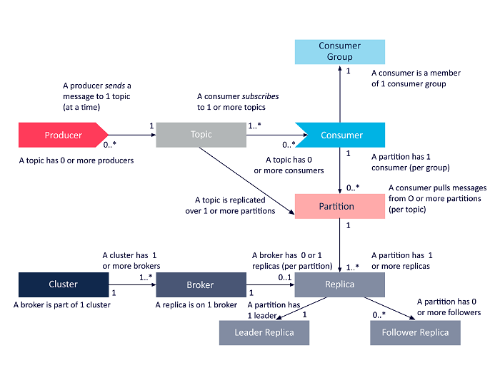

# kafka

<p align="center">
  
</p>

# Commands

Run kafka with `dc start`.<br/>
Open a shell with `dc kafka-kafka-1`.

List topics:
```
./kafka-topics.sh --bootstrap-server localhost:9092 --list
```

Delete a topic:
```
./kafka-topics.sh --bootstrap-server localhost:9092 --delete --topic test-topic
```

Create a topic
```
./kafka-topics.sh --bootstrap-server localhost:9092 --create --topic test-topic --partitions 1 --replication-factor 1
```

Start a producer:
```
./kafka-console-producer.sh --bootstrap-server localhost:9092 --topic test-topic
```

Start a consumer:
```
./kafka-console-consumer.sh --bootstrap-server localhost:9092 --topic test-topic
```

# kafkacat cli

Install kafkacat:
```
brew install kcat
```

List topics:
```
kcat -b localhost:9092 -L
```

Produce messages:
```
echo 'message' | kcat -b localhost:9092 -P -t test-topic
```

Consume messages:
```
kcat -b localhost:9092 -C -t test-topic -q -f 'Offset: %o\tPartition: %p\tKey: %k\tValue: %s\n'
```

Consume messages from the partition:
```
kcat -b localhost:9092 -C -t test-topic -p 0 -q -f 'Offset: %o\tPartition: %p\tKey: %k\tValue: %s\n'
```

Consume messages from the given offset:
```
kcat -b localhost:9092 -C -t test-topic -o 5 -q -f 'Offset: %o\tPartition: %p\tKey: %k\tValue: %s\n'
```

Consume the latest 5 messages from the topic:
```
kcat -b localhost:9092 -C -t test-topic -o -5 -e -q -f 'Offset: %o\tPartition: %p\tKey: %k\tValue: %s\n'
```

Consume the latest 5 messages from the partition:
```
kcat -b localhost:9092 -C -t test-topic -p 0 -o -5 -e -q -f 'Offset: %o\tPartition: %p\tKey: %k\tValue: %s\n'
```

Consume messages between two dates (epoch timestamps):
```
kcat -b localhost:9092 -C -t test-topic -o s@1762530534942 -o e@1762530752537 -e -q -f 'Offset: %o\tPartition: %p\tKey: %k\tValue: %s\n'
```
