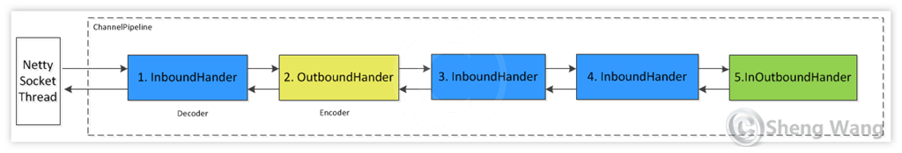
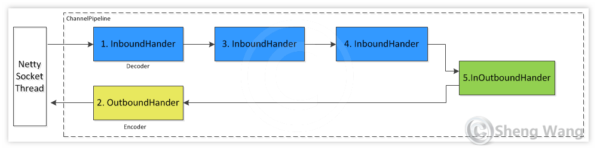
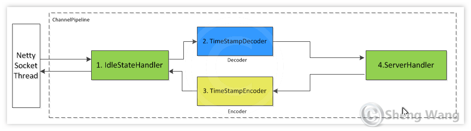

# netty

Example of how to work with Netty. 
To run project use `gradle run` with corresponding main class. 
Main class can be one of: `cloud9.NettyClient` or `cloud9.NettyServer`.

### Concepts

Netty's high performance rely on NIO.
Netty has several important parts: channel, pipeline, handler.
`Channel` can be thought as a tunnel that i/o request will go through. Every Channel has its own pipeline.
The most used channels are: channel.NioSocketChannel (for client), channel.NioServerSocketChannel (for server).
`Pipeline` can be thought as a bi-direction queue. It is filled with one or many handlers.
`Inbound`: only process read-in i/o event, `OutBound`: only process write-out i/o event, `InOutbound` process both.

Pipeline with 5 handlers:

This pipeline is equivalent to the following logic.
The input i/o event is process by handlers 1-3-4-5. The output is process by 5-2.

Inbound event propagation methods:
- ChannelHandlerContext.fireChannelRegistered()
- ChannelHandlerContext.fireChannelActive()
- ChannelHandlerContext.fireChannelRead(Object)
- ChannelHandlerContext.fireChannelReadComplete()
- ChannelHandlerContext.fireExceptionCaught(Throwable)
- ChannelHandlerContext.fireUserEventTriggered(Object)
- ChannelHandlerContext.fireChannelWritabilityChanged()
- ChannelHandlerContext.fireChannelInactive()
- ChannelHandlerContext.fireChannelUnregistered()

Outbound event propagation methods:
- ChannelHandlerContext.bind(SocketAddress, ChannelPromise)
- ChannelHandlerContext.connect(SocketAddress, SocketAddress, ChannelPromise)
- ChannelHandlerContext.write(Object, ChannelPromise)
- ChannelHandlerContext.flush()
- ChannelHandlerContext.read()
- ChannelHandlerContext.disconnect(ChannelPromise)
- ChannelHandlerContext.close(ChannelPromise)
- ChannelHandlerContext.deregister(ChannelPromise)

### Application

This example has 1 client and 1 server. 
Long connection is used for data transfering. 
Heart beat message send from server to client. 
This message has a timestamp of sending time from server. 
The client do nothing when get the heart beat but simply send it back to server. 
Server can print out the loopback delay by using recv time substract by sending time.
